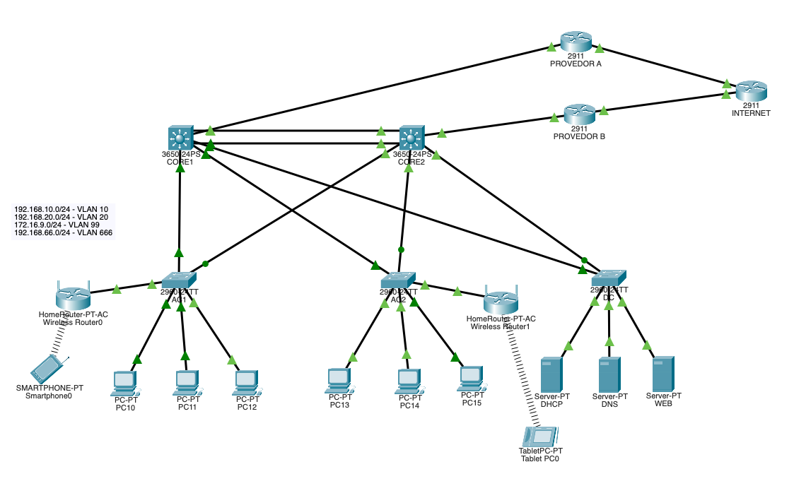

# Projeto de Rede - Packet Tracer

## 📌 Descrição
Simulação de rede corporativa criada no Cisco Packet Tracer.

## 🧠 Objetivo
Praticar conceitos de redes como:
- VLAN
- DHCP
- Roteamento
- Switches e roteadores

## 🏗️ Topologia
- X PCs
- X Switches
- X Roteadores

## ⚙️ Configurações
- VLANs configuradas: Sim
- DHCP: Sim
- Roteamento: Estático/Dinâmico (especificar)

## 📂 Arquivo
- REDES MAO NA MASSA 2 COMPLETO.pkt

## ▶️ Como abrir
1. Baixar o Cisco Packet Tracer
2. Abrir o arquivo `.pkt`

## 📸 Prints

